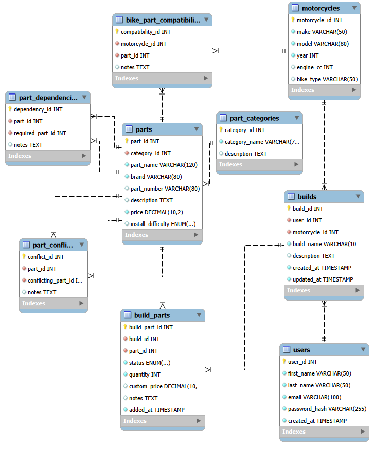

## Database Design

MotoBuild uses a MySQL database to store users, motorcycles, builds, parts, and compatibility rules.

### Main Tables

- `users`: stores customer accounts.
- `motorcycles`: stores available motorcycles.
- `builds`: stores each user's motorcycle project.
- `part_categories`: groups parts by type.
- `parts`: stores the parts catalog.
- `build_parts`: connects builds and parts and tracks planned/installed status.
- `bike_part_compatibility`: stores which parts fit which motorcycles.
- `part_dependencies`: stores parts that require other parts.
- `part_conflicts`: stores parts that cannot be used together.

### Main Relationships

- One user can have many builds.
- One motorcycle can be used in many builds.
- One build can contain many parts.
- One part can appear in many builds.
- One motorcycle can be compatible with many parts.
- One part can fit many motorcycles.
- One part can require another part.
- One part can conflict with another part.

### ERD

